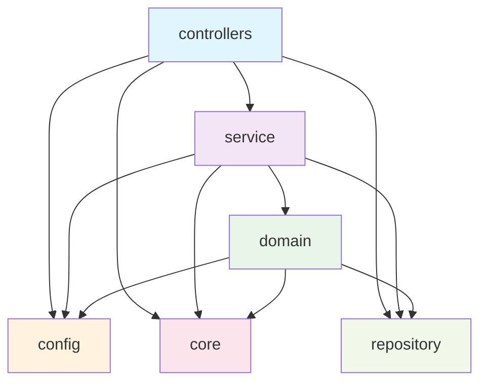

# Sight Spring Backend

쿠러그 사이트의 코틀린 / 스프링 기반 백엔드 레포지토리입니다.

## 요구사항

- Java 17
- Docker

## 설치 방법

```bash
git clone https://github.com/khu-khlug/sight-spring-backend.git
cd sight-spring-backend
./gradlew build
```

## 실행 방법

```bash
# 로컬 실행 시
./gradlew bootRun

# 도커 활용 시
docker compose up
```

애플리케이션은 `http://localhost:8080`에서 실행됩니다.

## 빌드 방법

```bash
# JAR 빌드 (`build/libs/` 하위에 생성됩니다.)
./gradlew build

# 도커 이미지 빌드
docker build -f Dockerfile.Build -t sight-spring-backend .
```

## 테스트 실행 방법

```bash
./gradlew test
```

## Lint 실행 방법

```bash
# Lint 검사
./gradlew ktlintCheck

# Lint 자동 수정
./gradlew ktlintFormat
```

## 프로젝트 구조

### 디렉토리 구조 규칙
`com.sight` 하위에는 다음 6개 디렉토리만 유지합니다:

- **config**: 애플리케이션 설정과 관련된 내용 (로직 포함 금지)
- **controllers**: 외부에서 들어오는 모든 요청(HTTP, 디스코드 이벤트 등)을 최초로 받는 곳
- **core**: 횡단 관심사와 관련된 모든 코드 (데이터베이스 연결, 인증/인가, 디스코드 클라이언트 등)
- **domain**: 도메인 모델과 도메인 서비스 (순수 함수, side-effect 없음)
- **repository**: 데이터 접근을 위한 리포지토리 인터페이스
- **service**: side-effect가 발생할 수 있는 로직 및 애플리케이션 처리 흐름 제어

### 의존성 방향
- 일반적인 로직 처리 흐름: `controllers` → `service` → `domain`
- 역방향 의존성은 금지
- `config`, `core`, `repository`는 다른 계층에서 접근 가능하지만 역방향은 불가



## 기능 활성화 여부 설정

### 디스코드 관련 기능

디스코드 관련 기능을 위해서는 디스코드 개발자 포탈에서 토큰을 발급 받아 넣어두어야 합니다. 하지만 모두가 디스코드 기능을 개발하는 게 아니기 때문에 디스코드 관련 기능을 끌 수 있게 합니다.

```sh
# `docker-compose.yaml` 혹은 `.env` 파일에서 아래 환경변수를 세팅합니다.
DISCORD_ENABLED=false
```

개발 환경에서는 기본적으로 꺼져있으며, 디스코드 관련 기능을 개발할 때는 해당 환경 변수의 값을 `true`로 설정해주세요.
